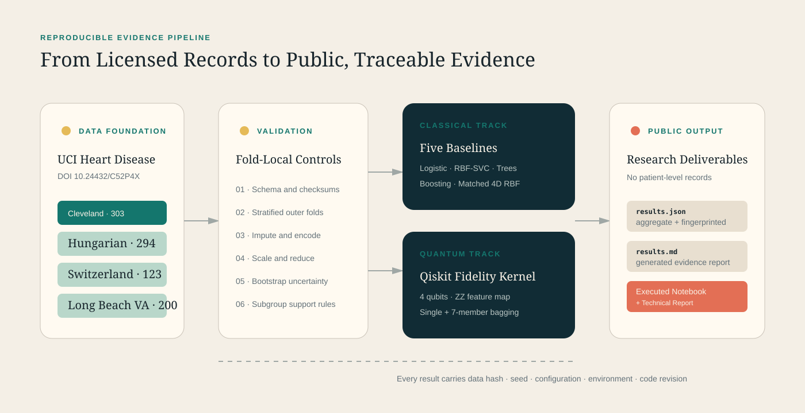

# Quantum-Enhanced Heart Disease Ensemble

[](https://github.com/JithuVathiath/quantum-heart-disease-ensemble/actions/workflows/quality.yml)
[](https://www.python.org/)
[](https://www.ibm.com/quantum/qiskit)
[](https://archive.ics.uci.edu/dataset/45/heart%2Bdisease)

A research-grade companion to the 2025 IEEE ICITIIT paper **"Prediction of Cardiac Disease Using Quantum Enhanced Ensemble Learning Approach"** by Jithu Vathiath Biju, Adithya P. Mallya, and P. Kirubanantham.

This repository asks a harder question than “what is the highest accuracy?” It tests whether a bagged quantum-kernel classifier remains convincing under leakage-safe preprocessing, paired uncertainty, a compute-matched classical baseline, and cross-hospital dataset shift.

> **Headline result:** Under the frozen reference protocol, the bagged quantum-kernel SVC reached **0.661 ROC AUC**, trailing the four-component RBF-SVC by **0.194** (95% paired bootstrap interval: -0.256 to -0.133). Logistic regression led the complete benchmark at **0.895 ROC AUC**. No quantum advantage was demonstrated.

## Explore the Evidence

- **Executed notebook:** [Quantum Heart Disease Reproduction](notebooks/quantum_heart_disease_reproduction.ipynb)
- **Technical report:** [Quantum-Enhanced Heart Disease Benchmark](reports/technical-report.md)
- **Generated results summary:** [Reproduction Benchmark Results](reports/results.md)
- **Versioned result artefact:** [`artifacts/public/results.json`](artifacts/public/results.json)
- **Associated paper:** [IEEE DOI 10.1109/ICITIIT64777.2025.11041018](https://doi.org/10.1109/ICITIIT64777.2025.11041018)
- **Dataset:** [UCI Heart Disease, DOI 10.24432/C52P4X](https://doi.org/10.24432/C52P4X)

## Published Result Versus New Evidence

The associated paper reported **90.16% accuracy** on the Cleveland dataset. That number is historical publication context. It is not presented as reproduced here because the exact original split and implementation artefacts are not available in this repository.

All results below were generated independently from the declared reference protocol:

| Model | Track | ROC AUC (95% CI) | Balanced Accuracy | Brier | Runtime |
| --- | --- | ---: | ---: | ---: | ---: |
| Logistic regression | Classical | **0.895** (0.858-0.928) | 0.809 | **0.129** | 0.06 s |
| Extra Trees | Classical | 0.893 (0.858-0.926) | **0.821** | 0.132 | 0.95 s |
| RBF-SVC, full representation | Classical | 0.881 (0.838-0.916) | 0.813 | 0.136 | 0.10 s |
| Gradient boosting | Classical | 0.869 (0.825-0.908) | 0.784 | 0.155 | 2.31 s |
| RBF-SVC, four components | Matched classical | 0.856 (0.811-0.897) | 0.785 | 0.152 | 0.07 s |
| Bagged quantum-kernel SVC | Quantum | 0.661 (0.605-0.721) | 0.598 | 0.235 | 1.80 s |
| Quantum-kernel SVC | Quantum | 0.647 (0.586-0.710) | 0.596 | 0.232 | 1.72 s |

Values are five-fold out-of-fold estimates on 303 Cleveland records. Intervals use 1,000 deterministic bootstrap resamples. Runtime is environment-specific and includes kernel construction for quantum models.

## What Makes This Different

- **Paper-to-reproducibility boundary:** the published claim and new execution are visibly separated.
- **Compute-matched comparison:** the primary RBF-SVC and quantum models receive the same four-component fold-local representation.
- **Quantum observability:** kernel alignment, eigenvalue spectrum proxies, effective rank, qubit count, and kernel time are retained per fold.
- **Transportability stress test:** models are trained and tested across four UCI hospital cohorts with sharply different missingness and prevalence.
- **Probability quality:** calibration, Brier score, threshold errors, and subgroup slices accompany ranking metrics.
- **No diagnosis theatre:** The notebook analyses aggregate research evidence; it never asks for patient details or emits a medical decision.
- **Traceable outputs:** dataset hashes, seeds, configuration, environment, code revision, and artefact fingerprint are recorded.

## Architecture



The Python research engine produces aggregate, patient-safe JSON evidence. The executed notebook and generated technical report consume that versioned artefact, so every displayed number remains traceable without exposing patient-level records.

## Reproduce the Benchmark

### Requirements

- Python 3.12
- Approximately 2 GB of free environment space

### Setup and data

```bash
python3.12 -m venv .venv
source .venv/bin/activate
pip install -e '.[dev,notebook,quantum]'
qheart data download --data-dir data
qheart data profile --data-dir data
```

The download command retrieves the official CC BY 4.0 UCI archive, blocks unsafe ZIP paths, and writes exact SHA-256 hashes to [`data/manifest.json`](data/manifest.json). Raw patient rows are ignored by Git.

### Execute and verify

```bash
qheart benchmark \
  --data-dir data \
  --config configs/reference.json \
  --output artifacts/public/results.json \
  --report reports/results.md

python scripts/build_technical_report.py
python scripts/build_notebook.py --execute
python scripts/validate_public_artifact.py artifacts/public/results.json
ruff check src tests scripts
mypy src
pytest --cov=qheart
```

The notebook can also be opened directly in VS Code, JupyterLab, or GitHub's notebook viewer. Its committed outputs are generated entirely from the aggregate JSON artefact, so opening it does not require the raw UCI files.

### Open the Notebook Locally

Open `notebooks/quantum_heart_disease_reproduction.ipynb` directly in VS Code, or click the
notebook link above to use GitHub's built-in renderer. For JupyterLab, install it in the project
environment and launch the notebook:

```bash
pip install jupyterlab
jupyter lab notebooks/quantum_heart_disease_reproduction.ipynb
```

JupyterLab is optional and is not required by the automated build.

## Repository Map

```text
artifacts/public/       Aggregate, versioned result artefact
configs/                Frozen experiment configuration
data/manifest.json      Dataset source and file hashes; no patient rows
docs/                   Protocol, data card, model card, architecture, ethics
notebooks/              Executed analysis notebook and portfolio figures
reports/results.md      Generated benchmark report
reports/technical-report.md  Comprehensive technical interpretation
scripts/                Artefact validation and document generation
src/qheart/             Data, modelling, evaluation, quantum, and reporting code
tests/                   Unit, integration, determinism, and Qiskit tests
```

## Evidence and Limitations

The UCI cohorts are small, historical, heterogeneous, and incomplete. Switzerland has a 93.5% positive rate, while Cleveland has a 45.9% positive rate. Missingness ranges from six feature cells in Cleveland to 782 in the Hungarian cohort. Cross-hospital results therefore describe transport stress, not clinical validation.

The quantum kernel is evaluated with an ideal statevector simulator. This demonstrates quantum-feature-map research engineering; it does **not** demonstrate speed-up, hardware advantage, clinical effectiveness, safety, or causal validity.

Read the [Research Protocol](docs/research-protocol.md), [Data Card](docs/data-card.md), [Model Card](docs/model-card.md), and [Responsible-Use Statement](docs/responsible-use.md) before interpreting the results.

## Attribution and Licence

The software is available under the [MIT Licence](LICENSE). The UCI Heart Disease dataset is separately licensed under [CC BY 4.0](https://creativecommons.org/licenses/by/4.0/) and must be attributed to its original creators. See [`CITATION.cff`](CITATION.cff) for software and paper citation metadata.

## Responsible-Use Notice

This software is for research, education, and portfolio demonstration only. It must not be used to diagnose disease, select treatment, assess an identifiable person, or replace qualified medical judgement.
