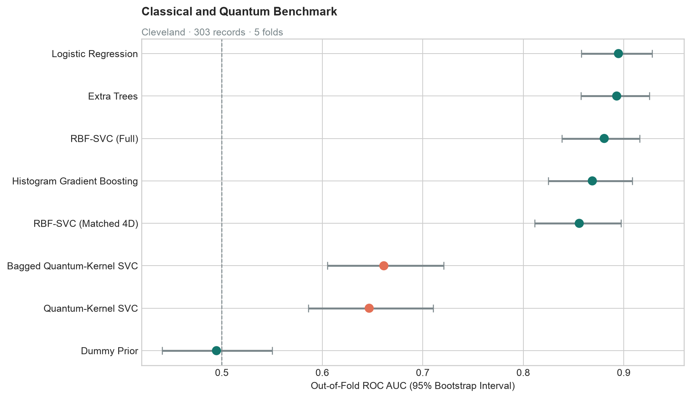
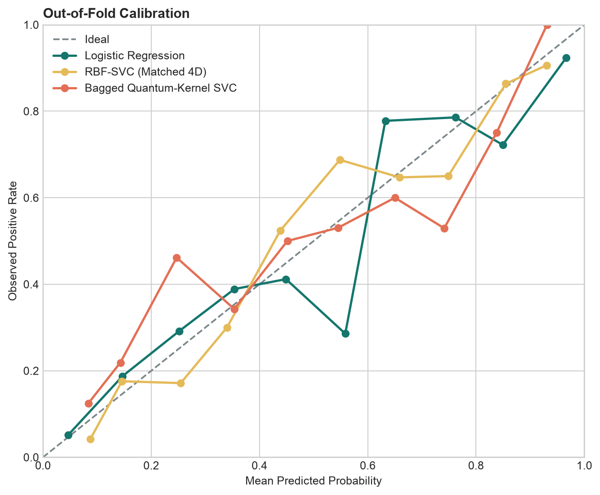
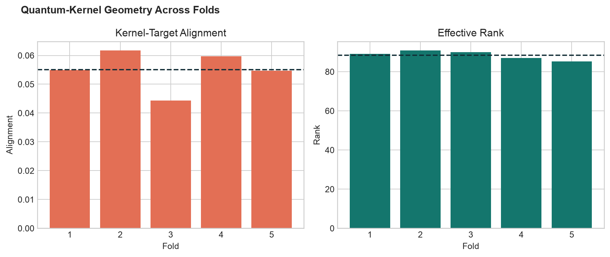
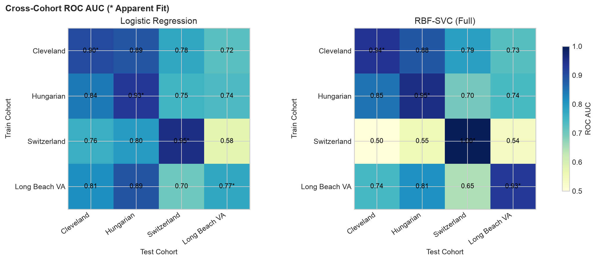

# Quantum-Enhanced Heart Disease Ensemble: Technical Report

**Report status:** Generated from the versioned public evidence artefact  
**Experiment:** `cleveland-reference-v1`  
**Artefact SHA-256:** `f672dbec410768b5b3b5cd2db9cbb049b234650c82192826f77ee81610f731ac`  
**Associated paper:** [IEEE DOI 10.1109/ICITIIT64777.2025.11041018](https://doi.org/10.1109/ICITIIT64777.2025.11041018)  
**Dataset:** [UCI Heart Disease, DOI 10.24432/C52P4X](https://doi.org/10.24432/C52P4X), CC BY 4.0

## Executive Summary

This study re-examines a quantum-enhanced ensemble approach to cardiac-disease classification
under a frozen, leakage-safe, and uncertainty-aware protocol. The strongest model was logistic
regression at **0.895 ROC AUC**. The bagged quantum-kernel SVC reached
**0.661 ROC AUC**.
Against the compute-matched four-component RBF-SVC, its paired difference was
**-0.194** (95% bootstrap interval
**-0.256 to -0.133**). The evidence therefore does not
demonstrate a quantum advantage under the declared protocol.

This negative result is scientifically useful. It replaces an isolated accuracy headline with a
traceable comparison of discrimination, calibration, subgroup behaviour, kernel geometry,
runtime, and cross-hospital transportability.

## Publication Claim and Reproduction Boundary

The associated 2025 paper reported **90.16%
accuracy** on the Cleveland dataset. That value is retained as historical publication context,
not presented as reproduced. The exact original split and implementation artefacts were not
available here. All numbers in this report were newly generated by the repository's declared
reference protocol and can be traced to the public JSON artefact.

## Research Questions

1. How does the quantum-kernel ensemble compare with strong classical baselines?
2. Does it outperform an RBF-SVC receiving the same four-component representation?
3. Are predicted probabilities well calibrated and errors stable across documented subgroups?
4. How well do classical conclusions transfer between the four UCI hospital cohorts?
5. Do quantum-kernel diagnostics help explain observed predictive performance?

## Data

The UCI Heart Disease collection contains **920 rows** and
**13 model features** across four hospital cohorts. Raw patient
rows are not committed to Git. The acquisition command downloads the official archive, rejects
unsafe ZIP paths, validates the schema, and records SHA-256 hashes in `data/manifest.json`.

| Cohort | Rows | Positive Rate | Missing Cells | Duplicate Rows |
| --- | ---: | ---: | ---: | ---: |
| Cleveland | 303 | 45.9% | 6 | 0 |
| Hungarian | 294 | 36.1% | 782 | 1 |
| Switzerland | 123 | 93.5% | 273 | 0 |
| Long Beach VA | 200 | 74.5% | 698 | 1 |

The prevalence and missingness differences are substantial. Switzerland's positive rate is
93.5%, and the Hungarian and Long Beach VA cohorts have hundreds of missing feature cells. These
conditions make cross-hospital results a transport stress test rather than clinical validation.

## Methods

### Reference Evaluation

- **Primary cohort:** Cleveland (303 records)
- **Validation:** 5-fold stratified out-of-fold evaluation
- **Uncertainty:** 1000 deterministic bootstrap resamples
- **Seed:** `20250913`
- **Preprocessing:** fold-local imputation, encoding, scaling, and representation fitting
- **Quantum representation:** 4 components, 4 qubits,
  ZZ feature map with 2 repetitions and linear entanglement
- **Bagging:** 7 quantum-kernel SVC members

The primary classical comparator is not the full-feature RBF-SVC. It is the four-component
RBF-SVC, because it receives the same fold-local representation as the quantum models. This makes
the central comparison more informative than an unconstrained algorithm leaderboard.

### Metrics

ROC AUC is the primary ranking metric. Balanced accuracy, sensitivity, specificity, precision,
recall, F1, Brier score, expected calibration error, confusion counts, and runtime provide
complementary evidence. All confidence intervals reported below are empirical bootstrap intervals.

## Benchmark Results

| Model | Track | ROC AUC (95% CI) | Balanced Accuracy | Brier | ECE | Runtime (s) |
| --- | --- | ---: | ---: | ---: | ---: | ---: |
| Logistic Regression | Classical | 0.895 (0.858-0.928) | 0.809 | 0.129 | 0.050 | 0.06 |
| Extra Trees | Classical | 0.893 (0.858-0.926) | 0.821 | 0.132 | 0.073 | 0.95 |
| RBF-SVC (Full) | Classical | 0.881 (0.838-0.916) | 0.813 | 0.136 | 0.031 | 0.10 |
| Histogram Gradient Boosting | Classical | 0.869 (0.825-0.908) | 0.784 | 0.155 | 0.095 | 2.31 |
| RBF-SVC (Matched 4D) | Classical | 0.856 (0.811-0.897) | 0.785 | 0.152 | 0.047 | 0.07 |
| Bagged Quantum-Kernel SVC | Quantum | 0.661 (0.605-0.721) | 0.598 | 0.235 | 0.083 | 1.80 |
| Quantum-Kernel SVC | Quantum | 0.647 (0.586-0.710) | 0.596 | 0.232 | 0.029 | 1.72 |
| Dummy Prior | Classical | 0.495 (0.440-0.550) | 0.500 | 0.248 | 0.000 | 0.03 |



Logistic regression and Extra Trees were effectively tied in discrimination, with overlapping
intervals. Logistic regression achieved the lowest Brier score among the evaluated non-dummy
models, while Extra Trees led balanced accuracy. The quantum models performed above the dummy
prior but well below both the full and matched classical alternatives.

## Primary Matched Comparison

The bagged quantum-kernel SVC minus matched four-component RBF-SVC ROC AUC difference was
**-0.194** (95% interval **-0.256 to
-0.133**). The bootstrap probability that the quantum model was better was
**0.0%**. The entire interval lies below zero, so this
experiment favours the matched classical baseline.

Bagging improved the single quantum-kernel SVC only modestly. It did not close the much larger
gap to the matched RBF model.

## Calibration and Threshold Behaviour



The full RBF-SVC had the lowest expected calibration error (0.031),
while logistic regression combined strong discrimination with a Brier score of
0.129. Calibration curves are descriptive: several bins contain few
records, particularly at extreme predicted probabilities. No probability from this historical
dataset should be interpreted as a clinically validated risk estimate.

## Quantum-Kernel Diagnostics

| Fold | Target Alignment | Effective Rank | Condition Proxy | Kernel Time (s) |
| ---: | ---: | ---: | ---: | ---: |
| 1 | 0.055 | 89.1 | 141,848 | 0.371 |
| 2 | 0.062 | 90.9 | 698,928 | 0.323 |
| 3 | 0.044 | 90.0 | 228,196 | 0.366 |
| 4 | 0.060 | 87.0 | 490,972 | 0.335 |
| 5 | 0.055 | 85.2 | 380,032 | 0.309 |



Mean kernel-target alignment was **0.055**,
and mean effective rank was **88.4**. The weak
alignment indicates that the encoded quantum similarity structure has limited correspondence with
the observed class structure. This offers a plausible geometric explanation for the predictive
gap; it is an interpretation, not a causal proof.

The statevector kernel ran on an ideal simulator. Its runtime and accuracy do not establish
hardware speed-up, noise resilience, or computational advantage.

## Cross-Hospital Transportability

Diagonal values marked with `*` are resubstitution scores and represent apparent fit, not external
validation. Off-diagonal cells are the relevant transport stress tests.

### Logistic Regression

| Train \ Test | Cleveland | Hungarian | Switzerland | Long Beach VA |
| --- | ---: | ---: | ---: | ---: |
| Cleveland | 0.904* | 0.887 | 0.776 | 0.724 |
| Hungarian | 0.840 | 0.932* | 0.752 | 0.738 |
| Switzerland | 0.760 | 0.796 | 0.954* | 0.577 |
| Long Beach VA | 0.814 | 0.890 | 0.702 | 0.774* |

### Full RBF-SVC

| Train \ Test | Cleveland | Hungarian | Switzerland | Long Beach VA |
| --- | ---: | ---: | ---: | ---: |
| Cleveland | 0.940* | 0.884 | 0.788 | 0.728 |
| Hungarian | 0.849 | 0.953* | 0.699 | 0.741 |
| Switzerland | 0.500 | 0.554 | 1.000* | 0.537 |
| Long Beach VA | 0.744 | 0.812 | 0.646 | 0.930* |



The classical models often transported reasonably from Cleveland to Hungarian, but performance
weakened on Switzerland and Long Beach VA. The most severe case was an RBF-SVC trained on
Switzerland and tested on Cleveland (0.500 ROC AUC), despite perfect apparent fit on Switzerland.
This contrast illustrates why same-cohort performance cannot substitute for external validation.

## Subgroup Audit

| Model | Group | Rows | Positive Rows | ROC AUC | Balanced Accuracy | Brier |
| --- | --- | ---: | ---: | ---: | ---: | ---: |
| Logistic Regression | Female | 97 | 25 | 0.926 | 0.812 | 0.090 |
| Logistic Regression | Male | 206 | 114 | 0.865 | 0.780 | 0.148 |
| Logistic Regression | Age Under 60 | 212 | 86 | 0.903 | 0.801 | 0.122 |
| Logistic Regression | Age 60 or Over | 91 | 53 | 0.865 | 0.810 | 0.147 |
| Bagged Quantum-Kernel SVC | Female | 97 | 25 | 0.676 | 0.574 | 0.212 |
| Bagged Quantum-Kernel SVC | Male | 206 | 114 | 0.656 | 0.593 | 0.245 |
| Bagged Quantum-Kernel SVC | Age Under 60 | 212 | 86 | 0.701 | 0.643 | 0.215 |
| Bagged Quantum-Kernel SVC | Age 60 or Over | 91 | 53 | 0.500 | 0.448 | 0.280 |

The subgroup analysis is descriptive and restricted to groups meeting a minimum support of
25 records. The bagged quantum model was particularly weak in
the age-60-or-over group (approximately chance-level ROC AUC). These results do not establish
fairness, absence of harm, or demographic validity because the sample is small, historical, and
not representative of a target clinical population.

## Threats to Validity

- Small historical cohorts with substantial differences in missingness and collection context.
- Binary target conversion discards ordinal severity information.
- Statevector simulation measures an idealised quantum kernel, not hardware advantage.
- Subgroup results are descriptive and may be unstable despite minimum-support rules.
- Predictive performance does not establish clinical benefit, causality, or safety.

Additional threats include multiple model comparisons, a single frozen hyperparameter protocol,
binary reduction of the original disease-severity target, and potential site-specific measurement
practices. Apparent-fit transport diagonal values are intentionally labelled to prevent them from
being mistaken for validation evidence.

## Reproducibility Record

| Item | Recorded Value |
| --- | --- |
| Experiment fingerprint | `c2e50c42dc96518b` |
| Artefact fingerprint | `f672dbec410768b5b3b5cd2db9cbb049b234650c82192826f77ee81610f731ac` |
| Code revision at benchmark time | `403856ffc11e9a79725629d2f32b4a81d97cc63a` |
| Python | 3.12.14 |
| NumPy | 2.5.3 |
| pandas | 2.3.3 |
| scikit-learn | 1.7.2 |
| Qiskit | 2.5.2 |
| Qiskit Machine Learning | 0.9.1 |
| Platform | macOS-15.5-arm64-arm-64bit |

To regenerate the complete benchmark:

```bash
python3.12 -m venv .venv
source .venv/bin/activate
pip install -e '.[dev,notebook,quantum]'
qheart data download --data-dir data
qheart benchmark --data-dir data --config configs/reference.json --output artifacts/public/results.json --report reports/results.md
python scripts/build_technical_report.py
python scripts/build_notebook.py --execute
python scripts/validate_public_artifact.py artifacts/public/results.json
pytest --cov=qheart
```

## Conclusion

Under the frozen protocol, the proposed quantum-kernel ensemble did not outperform a
compute-matched classical RBF-SVC, and logistic regression produced the strongest overall
discrimination. The result should not be generalised beyond these historical cohorts. The
project's contribution is the reproducible evidence system: lawful data acquisition,
leakage-controlled evaluation, paired uncertainty, calibration, kernel diagnostics, subgroup
auditing, transportability analysis, and a transparent negative finding.

This software and report are for research, education, and portfolio demonstration only. They must
not be used to diagnose disease, select treatment, or assess an identifiable person.
